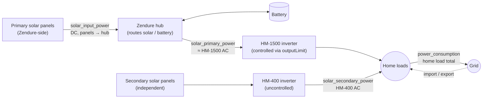

# ha-appdeamon-apps

AppDaemon apps running alongside Home Assistant for solar / battery / power-meter
control. Two main apps:

- **`PowerMeter.py`** — polls Shelly 3EM (grid) + 1PM (inverter total) every 3 s
  and publishes `sensor.power_consumption`, `sensor.power_import`,
  `sensor.power_export`, `sensor.power_solargen`.
- **`ZendureSetpoint.py`** + **`ZendureStateMachine.py`** — drive a Zendure
  SolarFlow hub via MQTT to maximize solar self-consumption (only what the
  home cannot use *now* gets stored). See `zendure-knowledgebase.md` for the
  background; this README covers the physical wiring the apps expect.

## Physical energy flow



## The four configurable power inputs

All four are set in `apps.yaml` under `power_inputs`. Each maps a logical
role to a Home Assistant sensor entity ID. Defaults preserve this user's
installation; change them to match yours.

| Logical name | Physical meaning | Used by |
|---|---|---|
| `power_consumption` | Total home load (W) | Setpoint — control rule (target = consumption − solar_secondary) |
| `solar_primary_power` | HM-1500 AC output (W). The inverter we control via `outputLimit`. | Reference / observability. The control loop sets it, doesn't read it back. |
| `solar_secondary_power` | HM-400 AC output (W). Uncontrolled solar inverter. | Setpoint — subtracted from home demand in the rule equation. |
| `solar_input_power` | DC into the Zendure hub from its own panels (W). | Setpoint — `dual-limit`/`solar-only` cap. State machine — bypass predicate. |

If `solar_secondary_power` is unavailable (e.g. OpenDTU WiFi drop), the
setpoint app treats it as 0. That's the safe direction: the Zendure is
slightly over-commanded (extra battery drain) but the home never exports
to grid.

### Why `solar_primary_power` defaults to a Zendure-reported number

`sensor.zendure_mqtt_outputhomepower` is the Zendure firmware's reported
DC feed into HM-1500 — about 5 % optimistic vs the actual HM-1500 AC
output (the inverter loses ~5 % converting DC → AC). A direct AC
measurement (e.g. a dedicated Shelly on the HM-1500 line) would be more
truthful. We deliberately don't use one:

- **Reliability.** The Zendure MQTT stream keeps publishing when OpenDTU
  freezes — the same WiFi-drop failure mode that motivated the HM-400
  fallback path. HM-inverter readings can simply disappear.
- **Update cadence.** Zendure reports much faster than the HM inverters,
  so the value is fresher.
- **Not actually used in the control loop.** The setpoint equation only
  uses `power_consumption − solar_secondary_power`. `solar_primary_power`
  is read into config and never used in math; it's purely for
  observability and dashboards. So the ~5 % DC-vs-AC accuracy gap doesn't
  propagate into anything we compute.

The ~5 % HM-1500 inverter loss is real and produces a chronic ~20–50 W
grid import depending on `outputLimit` — the safe direction, blended
with the deliberate `power_target_bias_steps: 0.5` half-step
under-supply. Nothing to compensate for as long as the control loop
stays open-loop. If/when we add closed-loop correction (read HM-1500
actual to true up `outputLimit`), the sensor choice becomes
load-bearing and we'd want a real AC measurement at that point.

## The control law

```
outputLimit = max(0, power_consumption − solar_secondary_power)
```

Capped per mode (see `zendure-knowledgebase.md`):

| Mode | Cap | Effect |
|---|---|---|
| `charge` | `0` | Battery only charges. House on grid + secondary inverter. |
| `solar-only` | quantize(`solar_input_power`) | Output ≤ Zendure DC solar. Battery doesn't drain; surplus charges battery. |
| `free` | `max_cap` (720 W) | Battery drains as needed; surplus solar still charges. |

Mode is picked every 20 s from SoC band, solar input, and bypass recency.
A bypass tracker (event-driven, debounced 60 s) latches the timestamp of
the last battery 100 %-with-solar event into `sensor.zendure_bypass_reached_at`,
which drives both the post-bypass deep-drain window (10 % floor for 10 h)
and the weekly force-charge override (174 h since last bypass → `charge`).

## Other (non-power) sensors used

These come from the Zendure HA integration with standardized names and
stay hardcoded:

- `sensor.zendure_mqtt_electriclevel` — battery SoC (%)
- `sensor.zendure_mqtt_packstate` — `idle` / `charging` / `discharging`
- `sensor.zendure_mqtt_outputpackpower` — pack output (W, used in bypass predicate)
- `sensor.zendure_mqtt_bypass` — Zendure-reported `pass` flag (BT-7 diagnostic)
- `sensor.zendure_bypass_reached_at` — written by the state machine, read by the setpoint app

## Modes & decision order

See `zendure-knowledgebase.md` for the full table; quick reference:

1. `hours_since_bypass ≥ 174` → `charge` (weekly health override)
2. `charge_latch` engaged → `charge` (battery floor with 5 % hysteresis)
3. `SoC ≥ 30 %` or `free_latch` already on → `free` (drain commitment)
4. `solar_input_power > 100 W` → `solar-only` (mid-SoC, real daylight)
5. else → `free` (mid-SoC, no real sun: battery is the only buffer)

## Shadow mode

`apps.yaml: dry_run: true` (default) routes all writes to `*_shadow`
sensors and `shadow/<topic>` MQTT — safe to run alongside the legacy
`python_script.zendure_*` for diff-comparison. Set `dry_run: false`
on **both** apps to go live.

`dry_run` lives only in `apps.yaml`, not in a HA `input_boolean`, so it
can't be flipped by accident from a dashboard.
