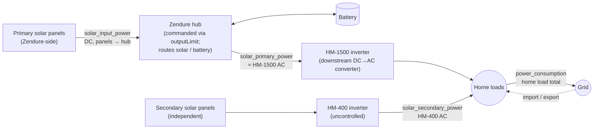

# ha-appdeamon-apps

AppDaemon apps running alongside Home Assistant for solar / battery / power-meter control.

## Apps

### PowerMeter

Polls Shelly 3EM (grid) and Shelly 1PM (total inverter AC output) every 3 s.
Derives home load, import/export, and solar generation from the raw phase readings.

**Sensors written**
- `sensor.power_consumption` — home load total (W)
- `sensor.power_consumption_filtered` — EMA-smoothed version
- `sensor.power_import` / `sensor.power_export` — grid exchange (W)
- `sensor.power_solargen` — total on-site inverter AC output (W)

**How to configure** — no `apps.yaml` section; edit `PowerMeter.py` directly:
- `url_3em` — Shelly 3EM RPC endpoint (`http://<ip>/rpc/EM.GetStatus?id=0`)
- `url_1pm` — Shelly 1PM RPC endpoint (`http://<ip>/rpc/PM1.GetStatus?id=0`)

---

### ZendureSetpoint

Runs every 20 s. Computes the `outputLimit` command for the Zendure SolarFlow hub via MQTT, maximizing solar self-consumption: only what the home cannot use right now goes into storage.

**Control law:** `outputLimit = max(0, power_consumption − solar_secondary_power)` — quantized and capped by mode (see [Control modes](#control-modes) below).

**Sensors written**
- `sensor.zendure_setpoint` (live) / `sensor.zendure_setpoint_shadow` (dry_run)
- `sensor.zendure_battery_discharged` / `*_shadow`

**How to configure** (`apps.yaml` → `zendure_setpoint`)

| Key | Default | Meaning |
|---|---|---|
| `power_inputs.*` | see file | Entity IDs for the four power signals |
| `max_cap` | `720` | Max outputLimit (W) |
| `power_step` | `30` | Quantization step (W) |
| `power_target_bias_steps` | `0.5` | Half-step under-supply bias |
| `batt_floor_after_bypass` | `10` | Discharge floor (%) inside the 10 h post-bypass window |
| `batt_floor_default` | `20` | Discharge floor (%) otherwise |
| `soc_promote_to_free` | `30` | SoC (%) at which we commit to drain for the cycle |
| `solar_threshold_w` | `100` | Solar input above this = real daytime (W) |
| `weekly_charge_force_hours` | `174` | Hours without bypass before forcing `charge` mode |
| `dry_run` | `true` | `true` = shadow, `false` = live (must match `ZendureHubMonitor`) |

---

### ZendureHubMonitor

Two responsibilities in one app:

1. **Bypass tracker** (event-driven, `listen_state`): detects when the battery completes a full charge cycle — SoC 100 %, packstate idle, outputpackpower 0, solar above threshold — debounced 60 s, then latches the timestamp into `sensor.zendure_bypass_reached_at`. ZendureSetpoint reads this for the post-bypass deep-drain window and the weekly force-charge override.
2. **One-time firmware init** (5 s after start): sends `minSoc`, `passMode`, `outputLimit: 0` so the Zendure firmware is in a known safe state before the setpoint loop's first tick.

**Sensors written**
- `sensor.zendure_bypass_reached_at` — ISO timestamp of last confirmed bypass
- `sensor.zendure_bypass_active` — 4-state diagnostic: `none` / `app_only` / `zendure_only` / `both`
- `sensor.zendure_operation_mode` (live) / `sensor.zendure_operation_mode_shadow` (dry_run)

**How to configure** (`apps.yaml` → `zendure_hub_monitor`)

| Key | Default | Meaning |
|---|---|---|
| `bypass_tracker.debounce_seconds` | `60` | Hold time before latching timestamp |
| `bypass_tracker.solar_threshold_w` | `50` | Min solar input for bypass predicate (W) |
| `bypass_tracker.fallback_days_when_missing` | `7` | Bootstrap age when sensor is missing |
| `firmware_init.min_soc` | `10` | Hard discharge floor (%) — multiplied ×10 by the app before sending |
| `firmware_init.pass_mode` | `0` | passMode sent to firmware (0 = normal) |
| `dry_run` | `true` | Must match `zendure_setpoint.dry_run` |

---

### EnergyMeterTotals

Runs every 5 min. Sums live OpenDTU inverter yield sensors with a fixed offset for decommissioned inverters and writes one cumulative energy sensor.

**Sensors written**
- `sensor.power_meter_solar_total` — all-time solar yield (kWh, `total_increasing`)

**How to configure** (`apps.yaml` → `energy_meter_totals`)

| Key | Default | Meaning |
|---|---|---|
| `update_interval` | `"5m"` | Poll cadence |
| `sensors` | *(required)* | List of HA entity IDs to sum (live inverter yield sensors) |
| `legacy_kwh_offset` | `0.0` | Fixed kWh from retired inverters to add to the total |

If any sensor in `sensors` is unavailable, the tick is skipped silently — no stale value is written.

---

## Physical energy flow

## Control modes

| Mode | outputLimit cap | Effect |
|---|---|---|
| `charge` | `0` | Battery only charges; home on grid + uncontrolled solar. |
| `solar-only` | quantize(`solar_input_power`) | Output ≤ Zendure's own solar DC. Battery preserved; surplus charges it. |
| `free` | `max_cap` (720 W) | Battery drains as needed; surplus solar still charges. |

Mode is picked every 20 s — decision order:

1. `hours_since_bypass ≥ 174` → `charge` (weekly health cycle)
2. `charge_latch` on → `charge` (SoC floor with 5 % hysteresis)
3. `free_latch` already on → `free` (daily drain commitment — prevents mid-day dip from stranding stored energy)
4. `SoC ≥ 30 %` → `free` (and engages free_latch)
5. `solar_input > 100 W` → `solar-only` (mid-SoC, real sun)
6. else → `free` (mid-SoC, no real sun — battery is the only buffer)

## Shadow mode

`dry_run: true` (default in `apps.yaml`) routes all writes to `*_shadow` sensors and `shadow/<topic>` MQTT. Safe to run alongside a legacy script for comparison. Flip `dry_run: false` on **both** `zendure_setpoint` and `zendure_hub_monitor` to go live.

`dry_run` lives only in `apps.yaml`, not in a HA toggle, so it cannot be flipped from a dashboard by accident.

## Background

For design decisions, sensor choices, and historical debug notes see `zendure-knowledgebase.md`. For the formal testable spec see `zendure-requirements.md`.
